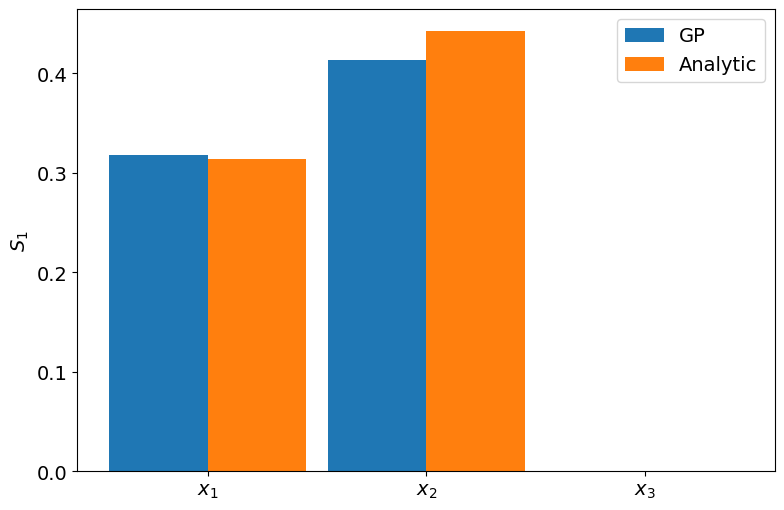
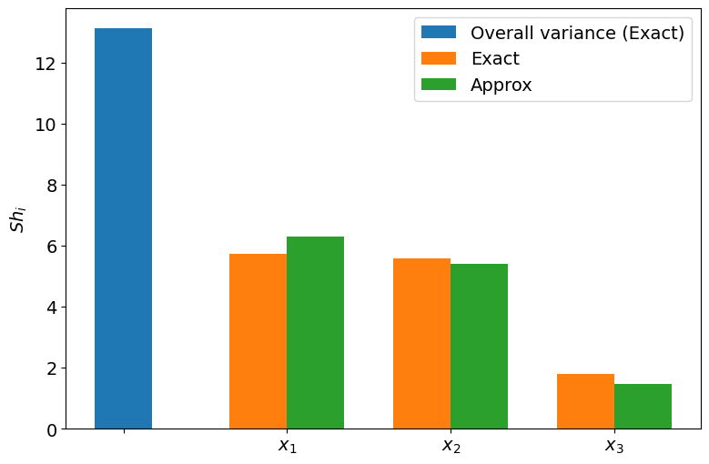
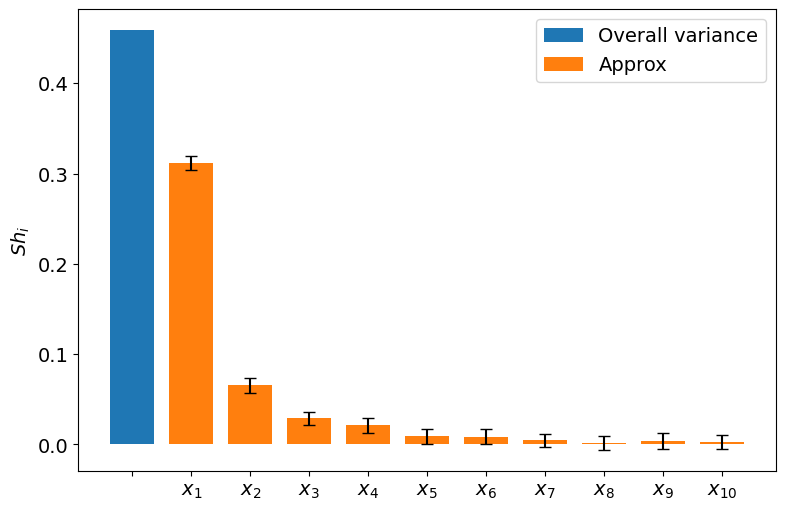

# UQGP: Uncertainty Quantification based on the Gaussian Process

This package performs uncertainty quantification (UQ) based on the Gaussian process (GP). To quantify parametric uncertainty in a mathematical model $\mathcal{M}\left( \cdot \right)$, we compute the following three metrics where we utilize the GP-based surrogate to speed up overall computations:

- First-order Sobol' indices following [Marrel et al. (2009)](https://doi.org/10.1016/j.ress.2008.07.008). This index is useful for factor prioritization.
- Shapley values following [Owen (2014)](https://doi.org/10.1137/130936233), [Song et al. (2016)](https://doi.org/10.1137/15M1048070), and [Goda (2021)](https://doi.org/10.1016/j.ress.2021.107702). Unlike the Sobol' indices, the sum of the Shapley values is equal to the total model variance.
- Univariate effects following [Younes et al. (2013)](https://doi.org/10.2136/vzj2011.0150)

## Getting Started

This project involves two sub-modules:

- `GP` folder contains Gaussian Process-related utilities based on `PyTorch`,
`GPyTorch`, and `BoTroch`.
- `UQ` folder contains Uncertainty Quantification-related functions to compute
the Sobol indices, the Shapley values, and the univariate effects.
- `test` folder contains two standalone test functions: the Ishigami function and the Sobol' g-function.

## Prerequisites

The `GPUQ` library are built on top of `PyTorch`, `GPyTorch` and `BoTorch`. Please install the newest version of each module.

You can also use this library with the `DEQN` library. In this case, you also need to install `Tensorflow`, `Hydra`, among others.

In any cases, we highly recommend creating a `virtualenv` and installing the necessary packages within this environment.

For example, we recommend installing the following versions or higher:

```bash
tensorflow==2.3.0
torch==2.0.1
gpytorch==1.10
botorch==0.8.5
hydra-core==1.3.1
```

## Installation

Download from [here](https://github.com/takafusui/UQGP/) and install the package somewhere your `PYTHONPATH` is accessible.

## Tests on the analytical functions

We provide two test functions, closely following [Marrel et al. (2009)](https://doi.org/10.1016/j.ress.2008.07.008) and [Goda (2021)](https://doi.org/10.1016/j.ress.2021.107702).

### Predictivity coefficient $Q_{2}$

Given the true mathematical model $\mathcal{M}\left( \cdot \right)$, we construct a GP surrogate model $\hat{\mathcal{M}}\left( \cdot \right)$ fitted on the given training data $\left( X, y\right)$ of size $n$. Typically, $X$ is drawn from the Latin Hypercube Sampling (: LHS), and $y$ is the outcome of the test function evaluated on each $X$. To evaluate the accuracy of $\hat{\mathcal{M}}\left( \cdot \right)$, we apply the predictivity coefficient $Q_{2}$

```math
Q_2 \left( y, \hat{y} \right) = 1 - \frac{\sum_{i=1}^{n_{\mathrm{test}}} \left( y_{i} - \hat{y}_{i} \right)^{2}}{\sum_{i=1}^{n_{\mathrm{test}}} \left( \overline{y} - y_{i}\right)^{2}},

```

where $y_{i}$ is the true test observation, $\overline{y}$ is the mean of the true test observations, and $\hat{y}_{i}$ is the GP predicted mean values. We evaluate the predictivity coefficient $Q_{2}$ on the test data of size, for example, $10,000$. In practical applications, a GP model with $Q_{2} > 0.7$ is often considered a good approximation of the true model.

### Ishigami function

We consider an analytical function, the Ishigami function, where the three input random variables $\left( X_{1}, X_{2}, X_{3} \right)$ follow uniform distribution on $\left[ -\pi, \pi \right]$

```math
f\left( X_{1}, X_{2}, X_{3} \right) = \sin X_{1} + 7 \sin^{2}X_{2} + 0.1 X^{4}_{3} \sin X_{1}
```

`test/ishigami_sobol_shapley.py` computes the first-order Sobol' indices and the Shapley values.

#### First-order Sobol' indices following [Marrel et al. (2009)](https://doi.org/10.1016/j.ress.2008.07.008)

The analytical values of the first-order Sobol' indices are known and they are $S_{1} = 0.3139, S_{2}=0.4424, S_{3}=0$.

We estimate the first-order Sobol' indices using a GP surrogate model. We achieve a good approximation of the first-order Sobol' indices using GP.



#### First-order Sobol' indices and Shapley values following [Goda (2021)](https://doi.org/10.1016/j.ress.2021.107702)

[Goda (2021), Fig. 1](https://doi.org/10.1016/j.ress.2021.107702) (the left figure below) estimated the Shapley values of the Ishigami function, whereas our estimation of the Shapley values using the exact and approximation methods are summarized in the right figure below.




### Sobol' g-function

We compute the first-order Sobol' indices for the Sobol' g-function that is defined for $d$ inputs $\left( X_{1}, \cdots, X_{d}\right)$ uniformly distributed on $\left[ 0, 1 \right]^{d}$

```math
g\left( X_{1}, \cdots, X_{d} \right) = \prod_{i=1}^{d}\frac{\left| 4X_{i} - 2 \right| + a_{i}}{1 + a_{i}}, a_{i} \geq 0
```

#### First-order Sobol' indices following [Marrel et al. (2009)](https://doi.org/10.1016/j.ress.2008.07.008)

Following [Marrel et al. (2009)](https://doi.org/10.1016/j.ress.2008.07.008), we choose $d=5$ and $a_{i} = i$ for $i=1, \cdots, 5$. With this particular setting, the first-order Sobol' indices are analytically given, and approximately $S_{1} =0.48, S_{2} = 0.21, S_{3} = 0.12, S_4 = 0.08, S_5 = 0.05$.

Our approximation results using GP are summarized below. Since GP modeling is a stochastic process, we should iterate to estimate our estimates' mean and standard deviation.


#### First-order Sobol' indices and Shapley values following [Goda (2021)](https://doi.org/10.1016/j.ress.2021.107702)

Following [Goda (2021), Fig. 3](https://doi.org/10.1016/j.ress.2021.107702), we choose $d=10$ and $a_{i} = i - 1$ for $i=1, \cdots, 10$.
[Goda (2021), Fig. 3](https://doi.org/10.1016/j.ress.2021.107702) (the left figure below) estimated the first-order Sobol' indices (Main effect) and the Shapley values of the Sobol' g-function. We estimate the first-order Sobol' indices and the Shapley values, where we report two Shapley values using the exact and approximation methods. Our companions are summarized in the right figure below.




## Use with the DEQN library

### Directory structure with DEQN

This package is assumed to be used on top of the policy functions and `tensorflow` data directory from the DEQN package.

The directory should be started from the DEQN base directory (typically, it is `USE_CONFIG_FROM_RUN`) and should look like the below:

```bash
DEQN_base_dir
│
├── ...
├── UQGPPreProcess.py
├── gen_simulate_QoIs_train.py
├── uq_gp_sobol.py
├── uq_gp_shapley.py
├── uq_gp_univariate.py
├── uq_gp_err.py
├── plt_sobol_gp.py
├── plt_shapley_gp.py
├── plt_univariate_gp.py
├── plt_err_gp.py
├── ...
│
└── UQresults/model_name/trainXYZ_LHS
    │
    ├── sobol
    │   ├──figs
    │   └──S1st_pred_QoI.csv
    │
    ├── shapley
    │   ├──figs
    │   ├──shapley_exact_QoI.csv
    │   └──shapley_approx_QoI.csv
    │
    ├── univariate
    │   ├──figs
    │   ├──train_X_bounds.csv
    │   └──uni_pred_QoI.csv
    │
    └── QoI.csv
```

Your `DEQN_base_dir` should be similar to this screenshot:


- `UQGPPreProcess.py` instantiates UQ analysis and stores common settings throughout the analysis. For instance, you can set the number of experimental design `N_train_X`, the model name `dir_name`, and the list of quantities of interest `QoIs_list`, among others.
- `gen_simulate_QoIs_train.py` is used to generate the initial experimental design. The generated samples are stored in `UQresults/model_name/trainXYZ_LHS` directory.
  - `model_name` is defined in`UQGPPreProcess.py`. See the `dir_name` entity.
  - In `trainXYZ_LHS`, `XYZ` refers to the number of initial experimental designs. You set `XYZ` in the `N_train_X` entity in `.hydra/config.yaml`. For testing purposes, you select `XYZ` to a small number (let's say 10), but for actual computations, `XYZ` should be big enough (let's say 200) depending on your applications.
- `sobol` directory includes the final figures (`pdf`) and the first-order Sobol indices in a `csv` format.
- `shapley` directory includes the final figures (`pdf`) and the Shapley values in a `csv` format.
- `univariate` directory includes the final figures (`pdf`) and the univariate effects in a `csv` format.
- `QoI.csv` is the outcome of the initial experimental design. You set the QoIs to be investigated in `UQGPPreProcess`. See `QoIs_list`.


### Experimental design

To generate experimental design, execute:

```bash
export USE_CONFIG_FROM_RUN_DIR=outputs/path_to_deqn_data && python gen_simulate_QoIs_train.py STARTING_POINT=LATEST hydra.run.dir=$USE_CONFIG_FROM_RUN_DIR constants.constants.N_train_X=XYZ
```

Here you override `N_train_X` by setting `constants.constants.N_train_X=XYZ`.

The tentative results are stored in the `UQ` directory as a `csv` format. Once sampling is over, the results move to `UQ/model_name/trainXYZ_LHS` directory.

### First-order Sobol indices

To compute the first-order Sobol indices based on GP, execute:

```bash
export USE_CONFIG_FROM_RUN_DIR=outputs/path_to_deqn_data && python uq_gp_sobol.py STARTING_POINT=LATEST hydra.run.dir=$USE_CONFIG_FROM_RUN_DIR constants.constants.N_train_X=XYZ
```

The results are stored in `UQ/model_name/trainXYZ_LHS/sobol` as `csv` data.

To plot the first-order Sobol indices, execute:

```bash
export USE_CONFIG_FROM_RUN_DIR=outputs/path_to_deqn_data && python plt_sobol_gp.py STARTING_POINT=LATEST hydra.run.dir=$USE_CONFIG_FROM_RUN_DIR constants.constants.N_train_X=XYZ
```

The figures are stored in `UQ/model_name/trainXYZ_LHS/sobol/figs`.

### Shapley values

To compute the Shapley values based on GP, execute:

```bash
export USE_CONFIG_FROM_RUN_DIR=outputs/path_to_deqn_data && python uq_gp_shapley.py STARTING_POINT=LATEST hydra.run.dir=$USE_CONFIG_FROM_RUN_DIR constants.constants.N_train_X=XYZ
```

The results are stored in `UQ/model_name/trainXYZ_LHS/shapley` as `csv` data.

To plot the Shapley values, execute:

```bash
export USE_CONFIG_FROM_RUN_DIR=outputs/path_to_deqn_data && python plt_shapley_gp.py STARTING_POINT=LATEST hydra.run.dir=$USE_CONFIG_FROM_RUN_DIR constants.constants.N_train_X=XYZ
```

The figures are stored in `UQ/model_name/trainXYZ_LHS/shapley/figs`.

### Univariate effects

To compute the univariate effects based on GP, execute:

```bash
export USE_CONFIG_FROM_RUN_DIR=outputs/path_to_deqn_data && python uq_gp_univariate.py STARTING_POINT=LATEST hydra.run.dir=$USE_CONFIG_FROM_RUN_DIR constants.constants.N_train_X=XYZ
```

The results are stored in `UQ/model_name/trainXYZ_LHS/univariate` as `csv` data.

To plot the univariate effects, execute:

```bash
export USE_CONFIG_FROM_RUN_DIR=outputs/path_to_deqn_data && python plt_univariate_gp.py STARTING_POINT=LATEST hydra.run.dir=$USE_CONFIG_FROM_RUN_DIR constants.constants.N_train_X=XYZ
```

The figures are stored in `UQ/model_name/trainXYZ_LHS/univariate/figs`.

### LOO error analysis

Under construction...

### Bayesian active learning

Under construction...

### Tail learning

In `post_process_learn.py`, we also compute

1. The prior distribution of ECS as like Roe and Baker (2007). Search around `l.551`.
2. The posterior distribution of ECS as like Kelly and Tan (2015). Search around `l. 578`.
3. The distribution of ECS implied by the mean of posterior as like Kelly and Tan (2015). Search around `l.604`.
4. Expected learning time to complete tail-learning as like Kelly and Tan (2015). Search around `l.650`.

To simulate the economy, we assume the true climate feedback parameter `truef`. Execute `post_process_learn.py` by adding your `truef` parameter such as `truef=0.65`

```bash
export USE_CONFIG_FROM_RUN_DIR=outputs/path_to_dean_data && python post_process_learn.py STARTING_POINT=LATEST hydra.run.dir=$USE_CONFIG_FROM_RUN_DIR constants.constants.truef=0.65
```

Note that all figures in `pdf` and tail learning time in `csv` are stored in your output directory (the same directory where you saved the distribution plots, etc.).